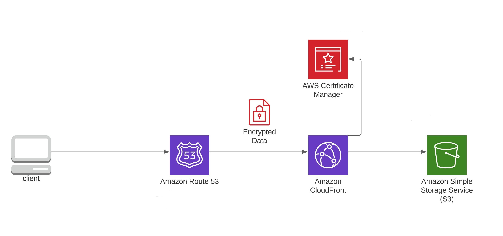

# Static-Website-Hosting-on-S3-Bucket-with-CloudFront and Route53


### Accessing Website    



- First create S3 bucket as a Container in AWS and upload static web page file.

- Now Enable Static website hosting permission and also off the block public access in bucket Permission tab and edit some policy that allow website to public.

- Bucket Policy 
  
  ```json
  {
    "Version": "2012-10-17",
    "Statement": [
      {
        "Sid": "PublicReadGetObject",
        "Effect": "Allow",
        "Principal": "*",
        "Action": [
          "s3:GetObject"
        ],
        "Resource": [
          "arn:aws:s3:::Bucket-Name/*"
        ]
      }
    ]
  }
  ```
  or download s3Bucket-Policy.json
  
  in this json code replace Bucket-name to Amazon Resource Name (ARN) which is given in bucket properties tab.
  
- Now go to Cloud front and create distribution

- Origin Domin select S3 static link

- Viewer > Redirect HHTP to HTTPS

- Cache key and origin Request > cache policy > cachingdisabled

- Alternate domain name (CNAME) > add item > 
  
  add registerted domain _name 

- Custom SSL certificate *- optional* > ACM ceritfi.

- ipv6 > off 

- Route53 create record A-type  put traffic alias to cloud front
  
  select cloudfront link e.g vfbvffvdsv.cloudfront.net and save it.

